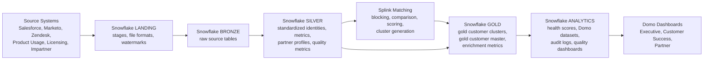
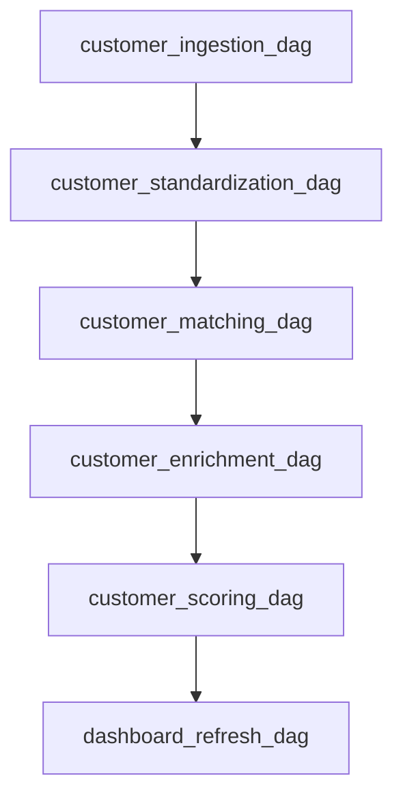
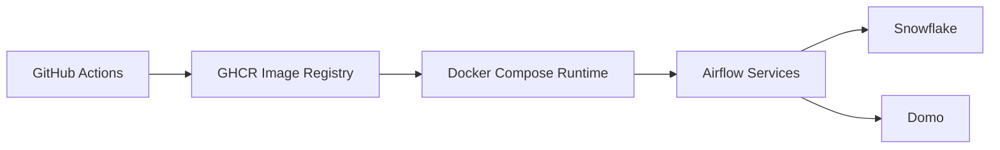

# Final Customer 360 Architecture

## Architecture Overview

Customer 360 consolidates CRM, marketing, support, product usage, licensing, and
partner data into trusted customer profiles, enrichment metrics, health scores, and
Domo-ready reporting datasets.



## Runtime Components

| Component | Responsibility |
| --- | --- |
| Python package | Ingestion, cleansing, matching adapters, golden records, enrichment, classification, Domo publishing, audit logging, and CLI operations. |
| Snowflake | LANDING, BRONZE, SILVER, GOLD, ANALYTICS storage and SQL transformations. |
| Airflow | Scheduled orchestration, retries, SLA callbacks, cross-DAG dependencies, and monitoring hooks. |
| dbt | SQL lineage, tests, documentation, snapshots, and analytics marts. |
| Great Expectations | Completeness, uniqueness, validity, consistency, and freshness checks. |
| Splink | Entity-resolution settings, pairwise matching, and cluster generation. |
| Domo | Executive, Customer Success, and Partner dashboard consumption. |
| Docker Compose | Local and small production-style runtime for Airflow, Postgres, Redis, and platform containers. |
| GitHub Actions | Code quality, tests, integration checks, Docker build, GHCR publishing, and deployment gates. |

## Data Layers

| Layer | Purpose | Key Assets |
| --- | --- | --- |
| LANDING | Raw file staging and load control. | Stages, file formats, source watermarks. |
| BRONZE | Source-shaped append tables. | Salesforce, Marketo, Zendesk, Product Usage, Licensing, Impartner bronze tables. |
| SILVER | Standardized and validated records. | `silver_customer`, `silver_customer_metric_daily`, `silver_partner_profile`, quality metrics. |
| GOLD | Resolved customer truth. | `gold_customer_clusters`, `gold_customer_master`, `customer_enrichment_metrics`. |
| ANALYTICS | Dashboard and operational outputs. | `customer_health_scores`, Domo datasets, audit logs, data-quality dashboards. |

## Orchestration



Airflow DAGs are intentionally thin. They call package-level jobs in
`src/customer360/interfaces/airflow/jobs.py`, while business logic remains in
domain, cleansing, matching, enrichment, classification, monitoring, and
infrastructure modules.

## Security Model

- Snowflake roles separate platform administration, loading, transformation, analyst
  access, Domo service access, and security administration.
- Sensitive fields such as email, phone, and address are protected by masking policies.
- Runtime secrets are provided through environment variables or secret managers.
- `.env` files are ignored; `.env.example` contains only placeholders.
- Docker runs the application image as a non-root Airflow user.
- Production readiness rejects missing authentication, development placeholders,
  non-HTTPS source APIs, missing API tokens, and production Domo dry-run mode.

## Scalability Model

- Snowflake warehouses are separated by workload class: ingestion, transformation,
  matching, and reporting.
- Airflow uses CeleryExecutor in the containerized runtime for horizontal worker
  scaling.
- Dashboard tables are pre-aggregated and clustered by common filters.
- Matching uses configurable blocking rules to limit pairwise comparison volume.
- Ingestion uses batch sizes, watermarks, and bounded retry policies.

## Observability Model

| Signal | Storage |
| --- | --- |
| Pipeline run status, duration, row counts, errors | `ANALYTICS.pipeline_execution_log` |
| Step-level ETL lineage and checksums | `ANALYTICS.etl_audit_log` |
| Great Expectations metrics | `ANALYTICS.data_quality_metrics` |
| Great Expectations run summaries | `ANALYTICS.data_quality_validation_runs` |
| Data-quality alerts | `ANALYTICS.data_quality_alerts` |
| Domo refresh reconciliation | `ANALYTICS.domo_dataset_refresh_log` |
| Dashboard quality rollups | `ANALYTICS.data_quality_dashboard_daily` |

Airflow failure, retry, and SLA callbacks emit structured events. Production readiness
checks validate structured JSON logging, audit history, Analytics audit-table placement,
and production alert configuration.

## Deployment Architecture



The Docker image contains the Python package, configs, Airflow DAGs, dbt project,
Great Expectations assets, and Snowflake SQL. Docker Compose supplies Airflow
webserver, scheduler, worker, triggerer, Postgres metadata database, Redis broker,
and a one-shot CLI container.

## Production Gates

Required before deployment:

```bash
customer360 healthcheck
customer360 readiness --environment prod --strict
python -m pytest
dbt parse --project-dir dbt/customer360 --profiles-dir dbt/customer360 --target prod
```

Containerized deployments should also run:

```bash
docker compose config
docker compose --profile tools run --rm customer360-cli customer360 readiness --environment prod --strict
```

## Extension Points

- Add new source systems by extending config, ingestion extractor mappings, bronze SQL,
  silver transformations, quality suites, and dbt source definitions.
- Add new dashboard datasets under `ANALYTICS`, document them in `dashboards/domo`,
  and register them in `DOMO_DATASET_TABLES`.
- Add new model features by extending enrichment metrics, health feature engineering,
  model training, prediction output, and dbt/Great Expectations contracts.
